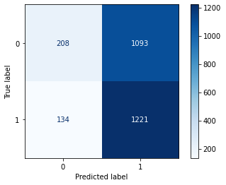
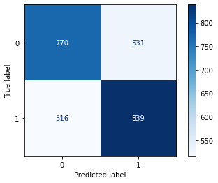
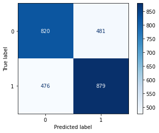
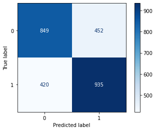
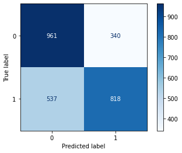
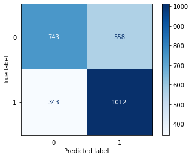
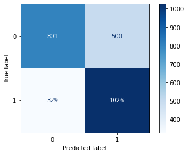

# Romanian sub-dialect identification
### Matei Gabriel Valentin - Grupa 243

## Reprezentare datelor

Pentru a clasifica texte din doua dialecte, am ales sa reprezint datele folosind n-grams.

Folosind `WhitespaceTokenizer` din biblioteca `nltk` am despartit toate datele in cuvinte. Din aceste cuvinte am extras seturi de cate 1,2,3-grame, iar din fiecare cuvant am extras cate 1,2,3-grame de caractere.

In urma procesarii tuturor datelor de antrenare am creat un vocabular care memoreaza de cate ori apare un n-gram. Am reprezentat cheile generic prin `{type}{n}[{value}]`, unde `type` este `c` daca este un n-gram format din caractere si `w` pentru cuvinte, `n` reprezinta numarul de caractere, respectiv cuvinte din secventa, iar `value` este secventa de caractere ce reprezinta n-gramul.

Mai jos este un exemplu de descompunere in n-grame a textului *"Ana are mere"*

```python
ngram_features('Ana are mere')

Output: {
 'c1[A]': 1,
 'c1[a]': 2,
 'c1[e]': 3,
 'c1[m]': 1,
 'c1[n]': 1,
 'c1[r]': 2,
 'c2[ A]': 1,
 'c2[ a]': 1,
 'c2[ m]': 1,
 'c2[An]': 1,
 'c2[a ]': 1,
 'c2[ar]': 1,
 'c2[e ]': 2,
 'c2[er]': 1,
 'c2[me]': 1,
 'c2[na]': 1,
 'c2[re]': 2,
 'c3[ An]': 1,
 'c3[ ar]': 1,
 'c3[ me]': 1,
 'c3[Ana]': 1,
 'c3[are]': 1,
 'c3[ere]': 1,
 'c3[mer]': 1,
 'c3[na ]': 1,
 'c3[re ]': 2,
 'w1[Ana]': 1,
 'w1[are]': 1,
 'w1[mere]': 1,
 'w2[Ana are]': 1,
 'w2[are mere]': 1,
 'w3[Ana are mere]': 1}
```
## Antrenarea modelului

Am facut o lista cu cativa clasificatori pe care biblioteca `sklearn` ii pune la dispozitie (`K Nearest Neighbors`, `Decision Tree`, `Random Forest`, `Logistic Regression`, `SGD Classifier`, `Naive Bayes`, `SVM Linear`) si apoi am iterat prin acesti clasificatori si apoi am comparat performantele acestora.

```python
names = ["K Nearest Neighbors", "Decision Tree", "Random Forest", "Logistic Regression", "SGD Classifier", "Naive Bayes", "SVM Linear"]

classifiers = [
    KNeighborsClassifier(),
    DecisionTreeClassifier(),
    RandomForestClassifier(),
    LogisticRegression(max_iter = 100),
    SGDClassifier(max_iter = 100),
    MultinomialNB(),
    SVC(kernel = 'linear')
]

models = list(zip(names, classifiers))

for name, model in models:
    model.fit(x_train, y_train)
    y_pred = model.predict(x_test)
    show_model_info(name, model, x_test, y_test, y_pred)
```

In urma executiei bucatii de cod de mai sus am obtinut diferite informatii despre performantele acestora pe datele de antrenare:

1. **K Nearest Neighbors**

```
Accuracy: 0.5380271084337349
```



```
              precision    recall  f1-score   support
           0       0.61      0.16      0.25      1301
           1       0.53      0.90      0.67      1355
    accuracy                           0.54      2656
   macro avg       0.57      0.53      0.46      2656
weighted avg       0.57      0.54      0.46      2656
```

2. **Decision Tree**

```
Accuracy: 0.6057981927710844
```



```
              precision    recall  f1-score   support
           0       0.60      0.59      0.60      1301
           1       0.61      0.62      0.62      1355
    accuracy                           0.61      2656
   macro avg       0.61      0.61      0.61      2656
weighted avg       0.61      0.61      0.61      2656
```

3. **Random Forest**

```
Accuracy: 0.639683734939759
```



```
              precision    recall  f1-score   support
           0       0.63      0.63      0.63      1301
           1       0.65      0.65      0.65      1355
    accuracy                           0.64      2656
   macro avg       0.64      0.64      0.64      2656
weighted avg       0.64      0.64      0.64      2656

```

4. **Logistic Regression**

```
Accuracy: 0.6716867469879518
```



```
              precision    recall  f1-score   support
           0       0.67      0.65      0.66      1301
           1       0.67      0.69      0.68      1355
    accuracy                           0.67      2656
   macro avg       0.67      0.67      0.67      2656
weighted avg       0.67      0.67      0.67      2656
```

5. **SGD Classifier**

```
Accuracy: 0.6698042168674698
```



```
              precision    recall  f1-score   support
           0       0.64      0.74      0.69      1301
           1       0.71      0.60      0.65      1355
    accuracy                           0.67      2656
   macro avg       0.67      0.67      0.67      2656
weighted avg       0.67      0.67      0.67      2656
```

6. **Naive Bayes**

```
Accuracy: 0.6607680722891566
```



```
              precision    recall  f1-score   support
           0       0.68      0.57      0.62      1301
           1       0.64      0.75      0.69      1355
    accuracy                           0.66      2656
   macro avg       0.66      0.66      0.66      2656
weighted avg       0.66      0.66      0.66      2656

```

7. **SVM Linear**

```
Accuracy: 0.6603915662650602
```


```
              precision    recall  f1-score   support
           0       0.66      0.65      0.65      1301
           1       0.66      0.67      0.67      1355
    accuracy                           0.66      2656
   macro avg       0.66      0.66      0.66      2656
weighted avg       0.66      0.66      0.66      2656
```

## Alegerea clasificatorului final

Uitandu-ma la leaderboard-ul de pe Kaggle am fost multumit de rezultatele obtinute si am decis sa folosesc un `VotingClassifier`. Am setat parametrul `voting = 'hard'`. Asta inseamna ca toti clasificatorii de mai sus vor vota o anumita intrare, iar rezultatul va fi egal cu majoritatea predictiilor.

Rezultatele acestuia sunt urmatoarele:

```
Accuracy: 0.6878765060240963
```



```
              precision    recall  f1-score   support
           0       0.71      0.62      0.66      1301
           1       0.67      0.76      0.71      1355
    accuracy                           0.69      2656
   macro avg       0.69      0.69      0.69      2656
weighted avg       0.69      0.69      0.69      2656
```

## Rezultat

Antrenand toti clasificatorii folosind datele de antrenare combinate cu cele de validare am reusit sa obtin un scor pe Kaggle de `0.72103` (Public Leaderboard) si `0.71565` (Private Leaderboard).
